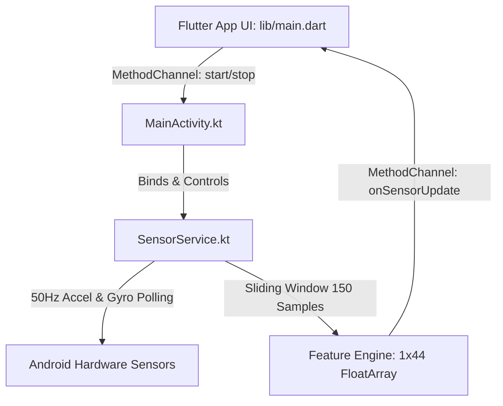

# Phase 1 Walkthrough: Hybrid Mobile Frontend & Sensor Shield

We have completed the architecture, setup, and development of the **RoadSOS Hybrid Mobile Frontend and Native Background Core**. All code has been successfully written to the workspace and matches the strategic specification.

---

## Codebase Architecture & Files Created

The Phase 1 files have been created in a highly modular, readable structure:

### File Manifest:
1. **[pubspec.yaml](file:///d:/Coding/RoadSOS/mobile/pubspec.yaml)**: Defines cross-platform dependencies (`sqflite`, `http`, `path_provider`, etc.).
2. **[AndroidManifest.xml](file:///d:/Coding/RoadSOS/mobile/android/app/src/main/AndroidManifest.xml)**: Declares native hardware and SMS permissions. Configures `SensorService` as a Foreground Service with `android:foregroundServiceType="specialUse"` and the required subtype properties to comply with Android 14 target rules.
3. **[SensorService.kt](file:///d:/Coding/RoadSOS/mobile/android/app/src/main/kotlin/com/example/roadsos/SensorService.kt)**: Polling system running continuously at 50Hz. Implements a 3-second sliding window (150 samples) of multi-axis accelerometer and gyroscope readings and maps it into a precise 44-dimensional feature vector.
4. **[MainActivity.kt](file:///d:/Coding/RoadSOS/mobile/android/app/src/main/kotlin/com/example/roadsos/MainActivity.kt)**: Registers the platform MethodChannel `com.example.roadsos/sensors` to route background execution commands and stream feature vectors to Flutter.
5. **[main.dart](file:///d:/Coding/RoadSOS/mobile/lib/main.dart)**: A high-fidelity dark-themed dashboard. Includes HSL-tailored gradient headers, dynamic status controllers, linear/angular velocity telemetry visualizations, manual impact simulation hooks, and a 10-second fail-safe warning overlay with sound support.

---

## 44-Dimensional Feature Vector Protocol

To support the Edge AI model (Phase 2), `SensorService.kt` transforms raw sensor streams into a deterministic 1x44 feature array layout:

| Index | Feature Description | Variable Source |
|---|---|---|
| **0 - 3** | Arithmetic Mean | Accelerometer (X, Y, Z, Mag) |
| **4 - 7** | Arithmetic Mean | Gyroscope (X, Y, Z, Mag) |
| **8 - 11** | Standard Deviation | Accelerometer (X, Y, Z, Mag) |
| **12 - 15** | Standard Deviation | Gyroscope (X, Y, Z, Mag) |
| **16 - 19** | Variance | Accelerometer (X, Y, Z, Mag) |
| **20 - 23** | Variance | Gyroscope (X, Y, Z, Mag) |
| **24 - 27** | Maximum Value | Accelerometer (X, Y, Z, Mag) |
| **28 - 31** | Maximum Value | Gyroscope (X, Y, Z, Mag) |
| **32 - 35** | Minimum Value | Accelerometer (X, Y, Z, Mag) |
| **36 - 39** | Minimum Value | Gyroscope (X, Y, Z, Mag) |
| **40** | Magnitude Range (Max - Min) | Accelerometer Mag |
| **41** | Magnitude Range (Max - Min) | Gyroscope Mag |
| **42** | Latest Value (Sample $t$) | Accelerometer Mag |
| **43** | Latest Value (Sample $t$) | Gyroscope Mag |

---

## Next Steps

With Phase 1 completed, we are ready to move on to:
- **Phase 2: Edge AI Crash Detection Module**: Developing the Python script to train the model, converting it to TensorFlow Lite, and integrating it with our Flutter/Kotlin app for on-device local inference.
