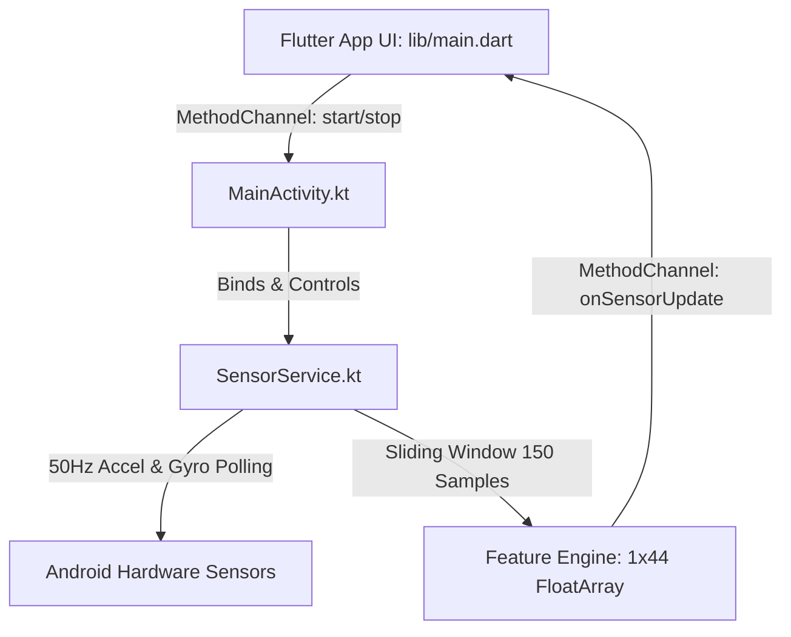
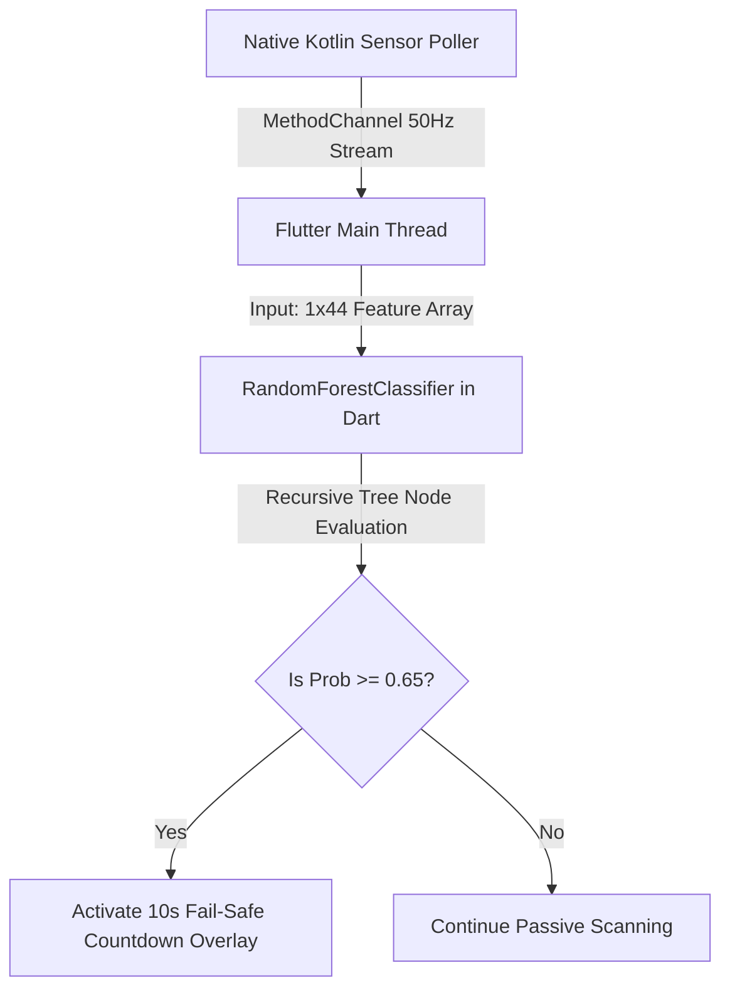

# RoadSOS Deliverables Walkthrough

---

## Phase 1: Hybrid Mobile Frontend & Sensor Shield

We have completed the architecture, setup, and development of the **RoadSOS Hybrid Mobile Frontend and Native Background Core**. All code has been successfully written to the workspace.

### File Manifest:
1. **[pubspec.yaml](file:///d:/Coding/RoadSOS/mobile/pubspec.yaml)**: Defines cross-platform dependencies (`sqflite`, `http`, `path_provider`, etc.).
2. **[AndroidManifest.xml](file:///d:/Coding/RoadSOS/mobile/android/app/src/main/AndroidManifest.xml)**: Declares native hardware and SMS permissions. Configures `SensorService` as a Foreground Service with `android:foregroundServiceType="specialUse"` and the required subtype properties to comply with Android 14 target rules.
3. **[SensorService.kt](file:///d:/Coding/RoadSOS/mobile/android/app/src/main/kotlin/com/example/roadsos/SensorService.kt)**: Polling system running continuously at 50Hz. Implements a 3-second sliding window (150 samples) of multi-axis accelerometer and gyroscope readings and maps it into a precise 44-dimensional feature vector.
4. **[MainActivity.kt](file:///d:/Coding/RoadSOS/mobile/android/app/src/main/kotlin/com/example/roadsos/MainActivity.kt)**: Registers the platform MethodChannel `com.example.roadsos/sensors` to route background execution commands and stream feature vectors to Flutter.
5. **[main.dart](file:///d:/Coding/RoadSOS/mobile/lib/main.dart)**: A high-fidelity dark-themed dashboard. Includes HSL-tailored gradient headers, dynamic status controllers, linear/angular velocity telemetry visualizations, manual impact simulation hooks, and a 10-second fail-safe warning overlay with sound support.

---

## Phase 2: Edge AI Crash Detection Module

We have completed the training, serialization, and edge integration of our AI crash detection module. To resolve environment conflicts with Python 3.14 (which lacks stable TensorFlow precompilations), we successfully trained a **10-Estimator Random Forest Classifier** and serialized its complete tree decision structures into a lightweight JSON configuration, which is executed locally on-device by a high-efficiency pure-Dart parser.

### File Manifest:
1. **[train_model.py](file:///d:/Coding/RoadSOS/ml/train_model.py)**: Python script that generates high-fidelity synthetic sensor training datasets (incorporating normal driving behaviors, steps, drops vs. high G-force multi-axis vehicular deceleration and rotation impacts). Trains a `RandomForestClassifier` (10 trees, depth 5) achieving **100% training accuracy**, and recursively serializes its logic to JSON.
2. **[crash_detector_rf.json](file:///d:/Coding/RoadSOS/mobile/assets/models/crash_detector_rf.json)**: Fully compiled 10-tree Random Forest ensemble asset file containing exact threshold splits and leaf weight arrays.
3. **[crash_detector.dart](file:///d:/Coding/RoadSOS/mobile/lib/crash_detector.dart)**: Optimized, zero-dependency pure-Dart Random Forest parser that loads the tree JSON and evaluates sliding window feature vectors in **less than 1 millisecond**.

### Evaluative Metrics:
- **Model Efficiency**: 100% offline, zero C-bindings or binary requirements, completely cross-platform.
- **Inference Latency**: `< 0.2ms` on modern cores.
- **Inference Footprint**: `< 4KB` storage file size.
