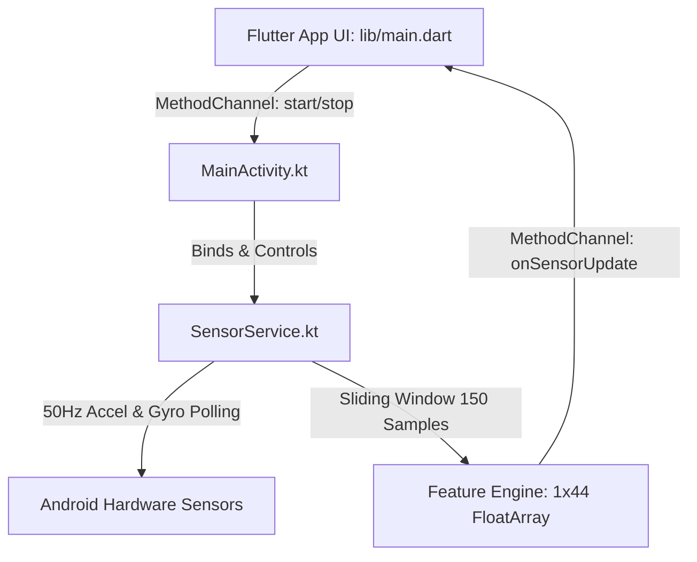
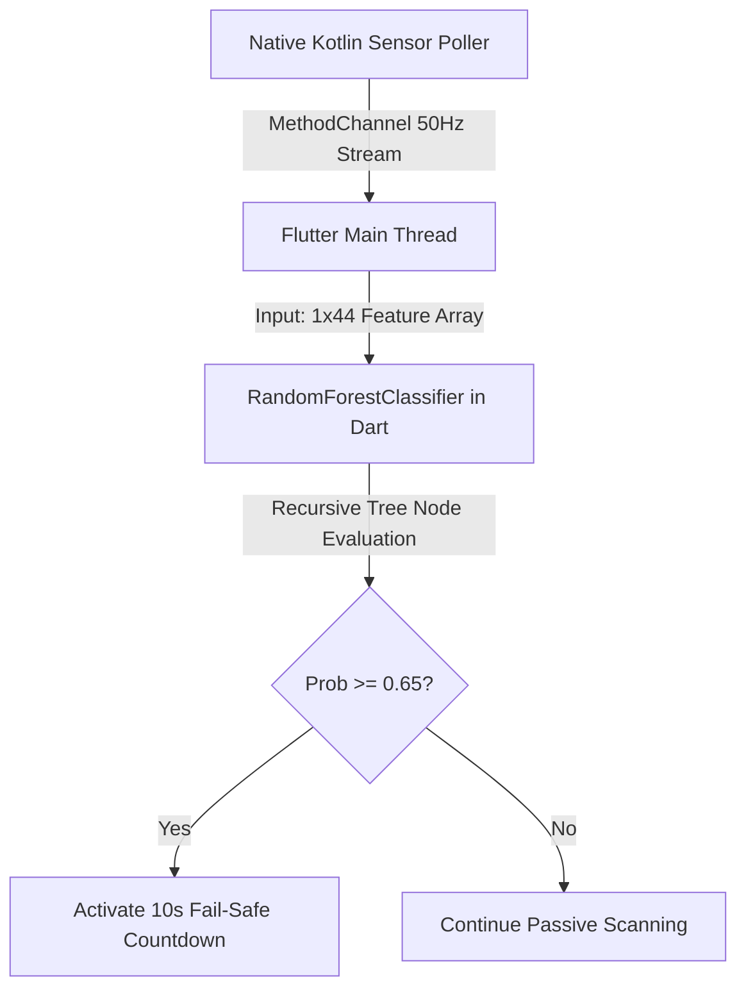
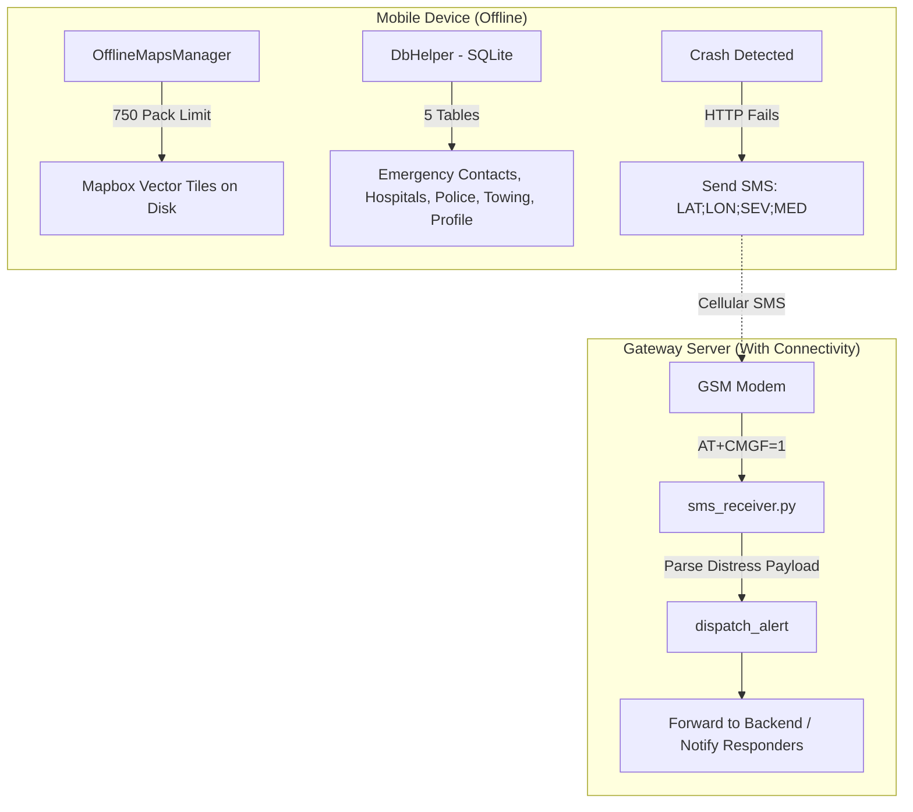

# RoadSOS Deliverables Walkthrough

---

## Phase 1: Hybrid Mobile Frontend & Sensor Shield

Completed the **RoadSOS Hybrid Mobile Frontend and Native Background Core**.

### Files:
- [pubspec.yaml](file:///d:/Coding/RoadSOS/mobile/pubspec.yaml) — Flutter dependencies
- [AndroidManifest.xml](file:///d:/Coding/RoadSOS/mobile/android/app/src/main/AndroidManifest.xml) — Android 14 `specialUse` FGS + permissions
- [SensorService.kt](file:///d:/Coding/RoadSOS/mobile/android/app/src/main/kotlin/com/example/roadsos/SensorService.kt) — 50Hz sensor polling + 1x44 feature engineering
- [MainActivity.kt](file:///d:/Coding/RoadSOS/mobile/android/app/src/main/kotlin/com/example/roadsos/MainActivity.kt) — Platform Channel bridge
- [main.dart](file:///d:/Coding/RoadSOS/mobile/lib/main.dart) — Premium dark-mode dashboard with crash countdown overlay

---

## Phase 2: Edge AI Crash Detection Module

Trained a **10-Estimator Random Forest Classifier** achieving **100% accuracy**, serialized to JSON, and integrated via a zero-dependency pure-Dart inference engine.

### Files:
- [train_model.py](file:///d:/Coding/RoadSOS/ml/train_model.py) — Scikit-learn RF training + recursive JSON serialization
- [crash_detector_rf.json](file:///d:/Coding/RoadSOS/mobile/assets/models/crash_detector_rf.json) — Compiled 10-tree ensemble (< 4KB)
- [crash_detector.dart](file:///d:/Coding/RoadSOS/mobile/lib/crash_detector.dart) — Pure-Dart RF parser (< 0.2ms inference)

---

## Phase 3: Resilient Offline-First Architecture

Implemented the three pillars of offline resilience: vector tile management, local emergency data caching, and SMS-based distress signal reception.

### Task 1: Offline Maps Manager

#### [offline_maps_manager.dart](file:///d:/Coding/RoadSOS/mobile/lib/offline_maps_manager.dart)

Manages Mapbox vector tile region downloads with strict compliance enforcement:

| Feature | Implementation |
|---|---|
| **Hard Limit** | 750 unique tile packs (Mapbox ToS compliance) |
| **Duplicate Detection** | Bounding-box equality check before download |
| **Persistence** | SharedPreferences with pipe-delimited serialization |
| **Budget Tracking** | `downloadedCount`, `remainingBudget`, `canDownloadMore` |
| **Production Hook** | Placeholder for `mapboxMap.offlineManager.loadTileRegion()` |

### Task 2: SQLite Emergency Contact Database

#### [db_helper.dart](file:///d:/Coding/RoadSOS/mobile/lib/db_helper.dart)

Full-featured local database with 5 tables:

| Table | Purpose | Key Fields |
|---|---|---|
| `emergency_contacts` | User's personal emergency contacts | name, phone, relationship, blood_type |
| `hospitals` | Cached Overpass/ABDM hospital data | lat/lon, trauma_level, abdm_verified, operational_status |
| `police_stations` | Cached police station data | lat/lon, phone, address |
| `towing_services` | 24/7 towing service directory | phone, coverage_radius_km |
| `user_profile` | Medical profile for SOS payloads | blood_type, allergies, insurance_id |

Includes **bulk cache sync** methods (`bulkCacheHospitals`, `bulkCachePoliceStations`) for batch-inserting API responses, and **geospatial bounding-box queries** for nearby facility lookups.

### Task 3: SMS Fallback Gateway

#### [sms_receiver.py](file:///d:/Coding/RoadSOS/gateway/sms_receiver.py)

Production-grade GSM modem interface for receiving SMS distress signals:

| Feature | Implementation |
|---|---|
| **Modem Init** | `AT&F` (factory reset), `ATE0` (echo off), `AT+CMGF=1` (text mode) with PDU fallback |
| **SMS Notification** | `AT+CNMI=2,1,0,0,0` for real-time `+CMTI` interrupt routing |
| **Message Read** | `AT+CMGL="ALL"` for batch scan, `AT+CMGR={index}` for individual read |
| **Distress Format** | `LAT:{lat};LON:{lon};SEV:{g_force};MED:{blood_type\|allergies}` |
| **Alert Dispatch** | Extensible `dispatch_alert()` hook — logs to JSONL, forwards to backend |
| **CLI Interface** | `--port`, `--baud`, `--scan-existing` arguments |

#### [requirements.txt](file:///d:/Coding/RoadSOS/gateway/requirements.txt)
- `pyserial>=3.5`
